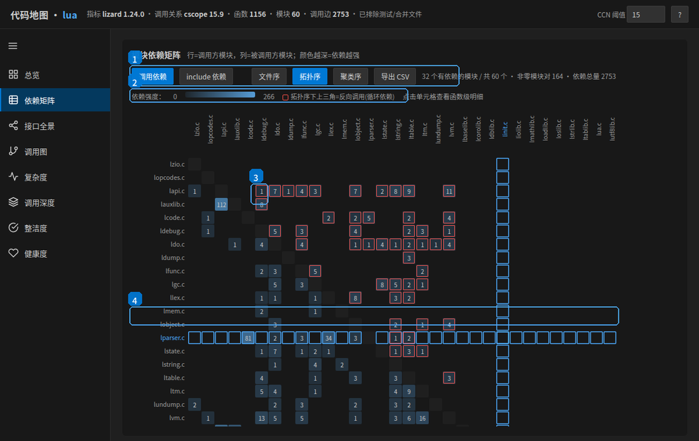
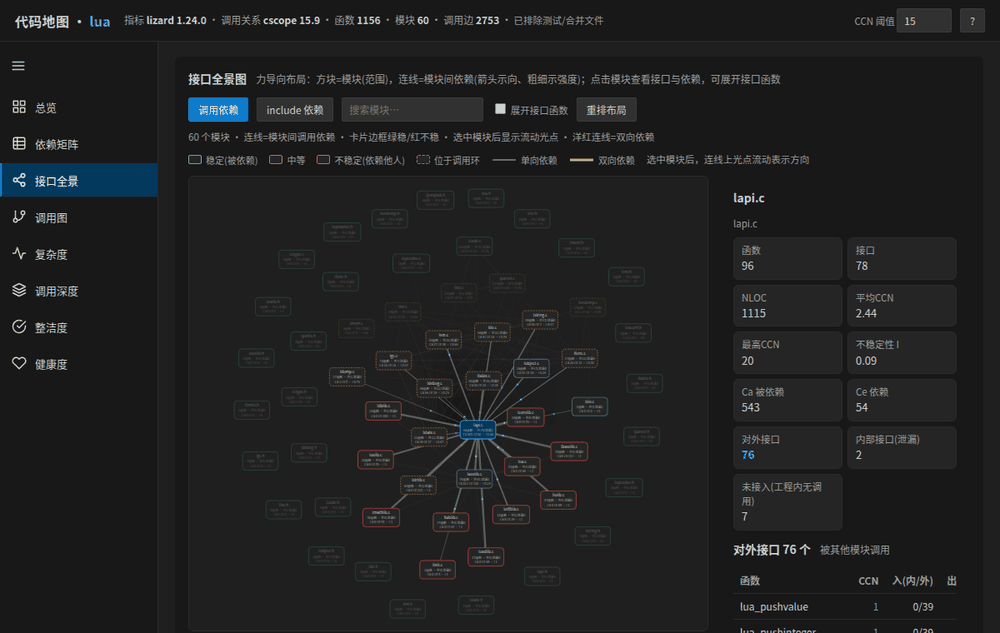
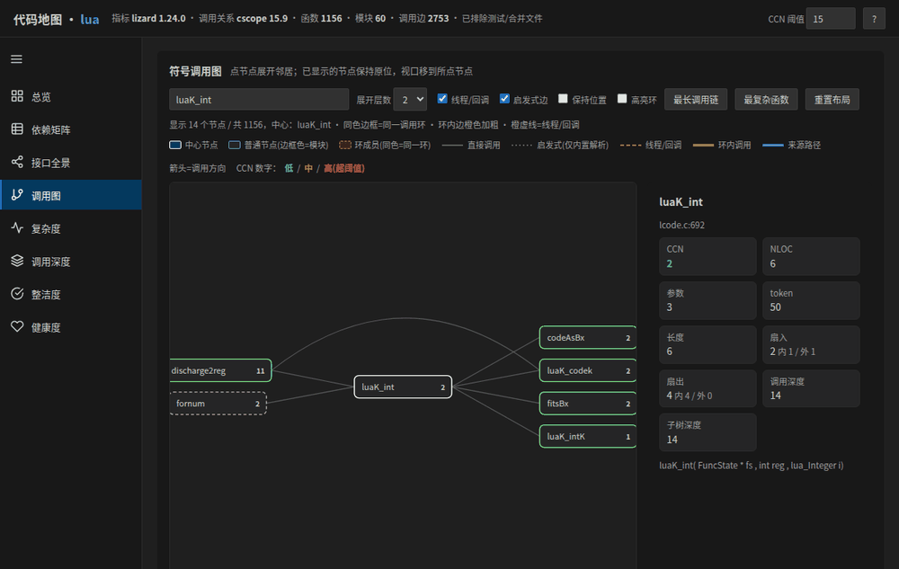
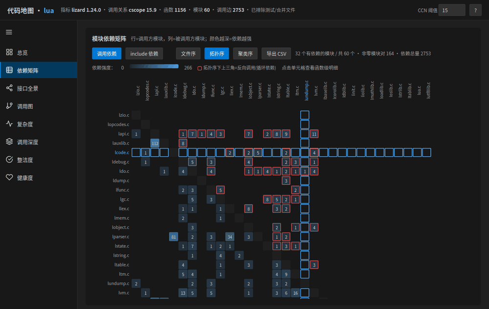
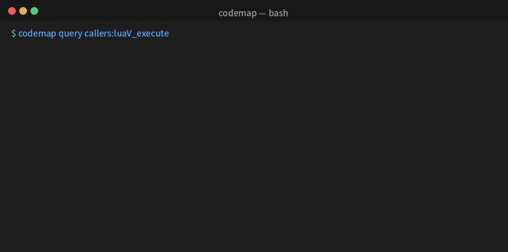
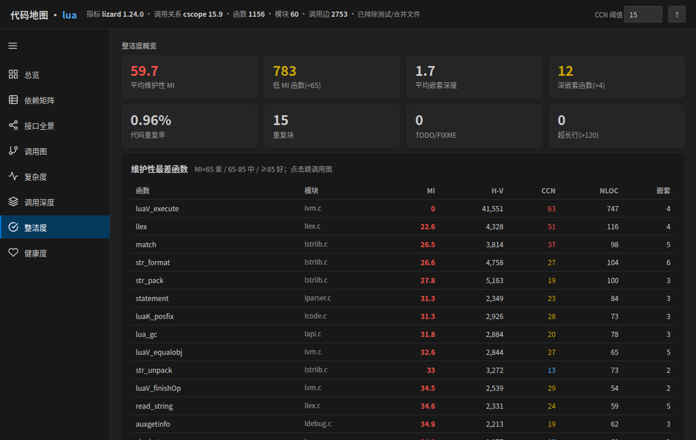

<div align="center">


# codemap · C/C++ 代码地图

**离线、零依赖，一图看懂 C/C++ 工程的结构与质量。**

把整个工程变成一张可交互的代码地图：模块依赖、符号调用图、函数复杂度、调用深度、调用环、公开接口、代码重复与可维护性——
并额外产出**面向 AI 的紧凑摘要**与**可查询接口 / MCP 服务**。


[](https://github.com/sixiaozhe/codemap/actions/workflows/release.yml)

[**中文**](README.md) · [English](README.en.md)

</div>

---

## ✨ 亮点

- **完全离线**：内置静态 `cscope` + 单文件 `lizard`，不联网、不 `pip`、不 `apt`、无需 root。
- **不需要头文件/编译数据库**：直接扫源码（lizard + cscope + 自研词法解析），C/C++ 皆可。
- **一个 HTML 看全部**：8 个交互页签，单文件自包含，浏览器直接打开。
- **AI 友好**：同时产出 `codemap.ai.md` / `codemap.ai.json`，并提供 `codemap query` 与 `codemap mcp`，大幅减少 agent 的交互次数与 token 消耗。
- **VSCode Dark Modern 风格**：左栏图标导航、可折叠、主题化配色。
- **为大工程准备**：稀疏依赖矩阵、自动降级、并行解析、结果截断显式提示。

## 🗺️ 功能一览

### 总览（标注）


① KPI 三组（规模 / 复杂度 / 耦合）　② 健康度评分与扣分拆解　③ CCN 阈值（全局联动配色/热点/评分）　④ 最复杂函数　⑤ 左侧图标导航（可折叠）

### 依赖矩阵（标注）



① 模式 / 排序 / 导出 / 统计　② 依赖强度色阶　③ 上三角红框 = 反向调用（循环依赖）　④ 悬停单元格 → 整行整列高亮

| 页签 | 内容 |
|---|---|
| **总览** | 健康度评分、KPI（规模/复杂度/耦合）、最复杂函数、重点风险 |
| **依赖矩阵** | 模块×模块 DSM 热力图，**默认拓扑序**（上三角标红=循环依赖），可切聚类序；只显示有依赖的模块 |
| **接口全景** | 力导向模块地图：卡片=模块范围、连线=依赖、光点流动示方向、洋红=双向；点模块看**对外/内部(泄漏)/未接入**接口 |
| **调用图** | 分层调用图（左调用者/右被调用者），平滑动画、连线绕开节点、**游走路径高亮**、**同色=同一调用环** |
| **复杂度** | 全量函数表，可排序/过滤/分页，一键导出 CSV |
| **调用深度** | 深度分布、最长调用链、逐函数最长链 |
| **整洁度** | **维护性指数 MI**、Halstead、**嵌套深度**、**代码重复块**、注释率、TODO/超长行、include 环/缺守卫 |
| **健康度** | 评分拆解（权重可调）、模块记分卡、调用环明细、风险清单 |

### 接口全景（光点示方向、环内高亮、模块详情）



### 调用图（游走高亮来源路径、调用环同色、连线绕行）



### 依赖矩阵（拓扑序、上三角标红=循环依赖、鼠标十字高亮）



### 命令行按需查询（省 token、省交互）



### 整洁度（维护性指数 MI / 嵌套深度 / 重复块 / 卫生检查）



> 以上动图均由**真实工具输出**（Lua 5.4 工程）录制，非示意图。

## 📂 示例

`examples/` 内含对 **Lua 5.4** 生成的示例地图（自包含 HTML），**不含被分析工程的源码**；复现步骤见
[`examples/README.md`](examples/README.md)。

## 🚀 快速开始

```bash
tar xzf codemap-toolkit-*.tar.gz
cd codemap-toolkit-*
./install.sh                       # 默认装到 ~/.local，无需 root
export PATH="$HOME/.local/bin:$PATH"

cd /你的工程目录
codemap .                          # 生成 ./codemap.html 及 AI 摘要
codemap -o /tmp/map.html ./src "tests/,third_party/"   # 指定输出 + 排除
```

要求：**Linux x86_64** + **Python 3.6+**（内置 cscope 为静态二进制，其余为纯 Python）。

## 🔎 命令

```bash
# 生成（HTML + AI 摘要）
codemap [-o 输出.html] <项目目录> [排除模式(逗号分隔)]

# 按需查询（省 token、省交互）——默认读取 ./codemap.ai.json
codemap query callers:<函数>     # 谁调用了它
codemap query callees:<函数>     # 它调用了谁
codemap query def:<函数>         # 定义位置
codemap query module:<文件>      # 模块概览
codemap query hotspots[:N]       # 复杂度热点
codemap query cycles             # 调用环
codemap query search:<子串>      # 按名搜索

# MCP 服务（让 AI 直接调用工具）
codemap mcp --data ./codemap.ai.json
```

## 🤖 面向 AI

生成后会得到两份机器/模型友好的产物（与输出同名）：

- `codemap.ai.md` —— ~十几 KB 的紧凑摘要：概览 / 热点函数 / 模块表 / 调用环 / 最长链 / 接口 / 卫生。**给模型先读它，而不是读 HTML**。
- `codemap.ai.json` —— 机器可读数据，供 `query` 与 MCP 使用。

不把整张图塞进上下文，而是**先摘要、再按需查询**，用查询返回的 `file:line` 只读关键源码片段。

MCP 暴露的工具：`codemap_overview`、`codemap_find_symbol`、`codemap_callers`、`codemap_callees`、`codemap_module`、`codemap_hotspots`、`codemap_cycles`。

包内 `skill/codemap/SKILL.md` 是一份 agent skill，安装后代理可在相关任务中自动加载使用：

```bash
cp -r skill/codemap ~/.opencode/skills/        # opencode
cp -r skill/codemap ~/.claude/skills/          # Claude Code
```

## 📊 指标

| 指标 | 含义 | 参考 |
|---|---|---|
| CCN | 圈复杂度 = 1 + 判定点数 | ≤10 严 / ≤15 松 |
| NLOC / 参数 / 嵌套 | 非空非注释行 / 形参数 / 控制结构最大嵌套 | ≤30–50 / ≤4–5 / ≤3–4 |
| 扇入(内/外) · 扇出(内/外) | 被多少函数调用 / 调用了多少函数（同文件/跨文件） | — |
| 深度 / 子树深度 | 到入口层数 / 到叶子层数（按强连通分量缩点） | — |
| Ca / Ce / I | 被依赖 / 依赖 / 不稳定性 `I=Ce/(Ca+Ce)` | I 越接近 0 越稳定 |
| 对外 / 内部(泄漏) / 未接入接口 | 被外部调用 / 非 static 仅本模块用 / 非 static 无人调用 | 泄漏项建议收敛为 static |
| 环 | 调用环（强连通分量） | 越少越好 |
| MI | 维护性指数（Halstead 体积 + CCN + NLOC） | ≥85 好 / <65 差 |
| 重复率 | 克隆代码占比 | <3–5% |

## 🧩 工作原理

- **复杂度/规模/嵌套/Halstead/重复**：`lizard`（`--csv -Ehalstead -ENS` 与 `-Eduplicate`）。
- **符号与调用关系**：`cscope` + **自研纯 Python 词法解析**（补齐 C++ 类内联/限定名盲区）+ **线程/回调匹配**（`pthread_create`/`std::thread`/`CreateThread`…，可用 `spawn.conf` 扩展）。
- **派生指标**：模块依赖矩阵、扇入/扇出、调用深度、强连通分量（环）、公开接口、维护性指数、include 卫生等，均由 `analyze.py` 计算。
- **呈现**：`template.html` + `build_html.py` 生成单文件交互式 HTML（无任何外链、离线可用）。

## 📁 目录结构

```
codemap/
├── bin/
│   ├── cscope            # 静态二进制（x86_64）
│   ├── lizard.pyz        # 单文件复杂度分析器（含扩展）
│   └── codemap           # 命令行入口
├── share/codemap/        # analyze/ai_export/query/mcp/build_html + 模板 + spawn.conf
├── skill/codemap/        # agent skill
├── examples/             # 示例产物（Lua 5.4 的代码地图）
├── docs/                 # README 用的动图
├── install.sh
└── uninstall.sh
```

## ⚠️ 已知限制

- 调用关系为**启发式**：不含宏展开、函数指针、虚函数动态分派；线程/回调可识别。用于导航很有效，下结论前请结合源码复核。
- `#if 0` 注释掉的代码会被自动剔除；`#else/#elif` 有效分支保留。
- 内置 `cscope` 为 **x86_64 静态二进制**；ARM/MIPS 需自行编译。
- 结果是**快照**，代码变更后需重新生成。
- 大工程：依赖矩阵自动降级为稀疏列表、接口全景限流（界面会提示）。

## 📄 许可

本项目代码采用 **MIT**。内置组件：`cscope`（BSD）、`lizard`（MIT）。详见 `LICENSE`。
